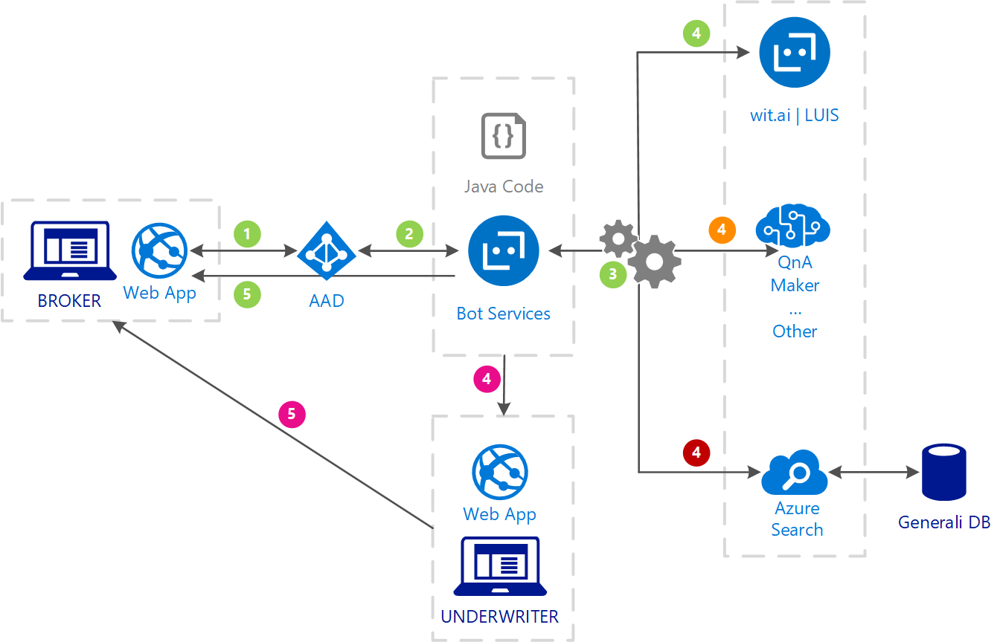
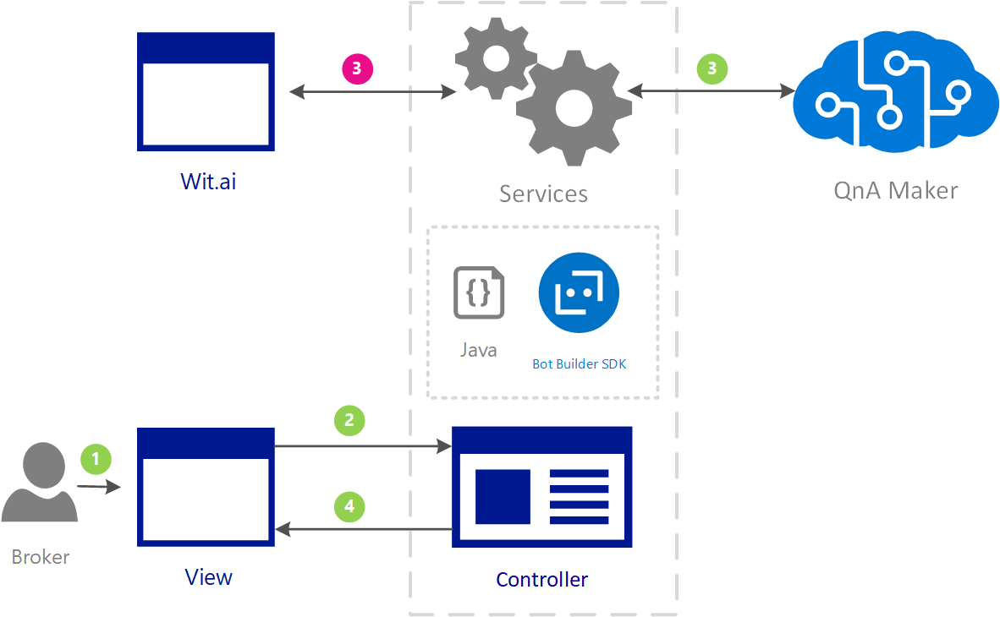
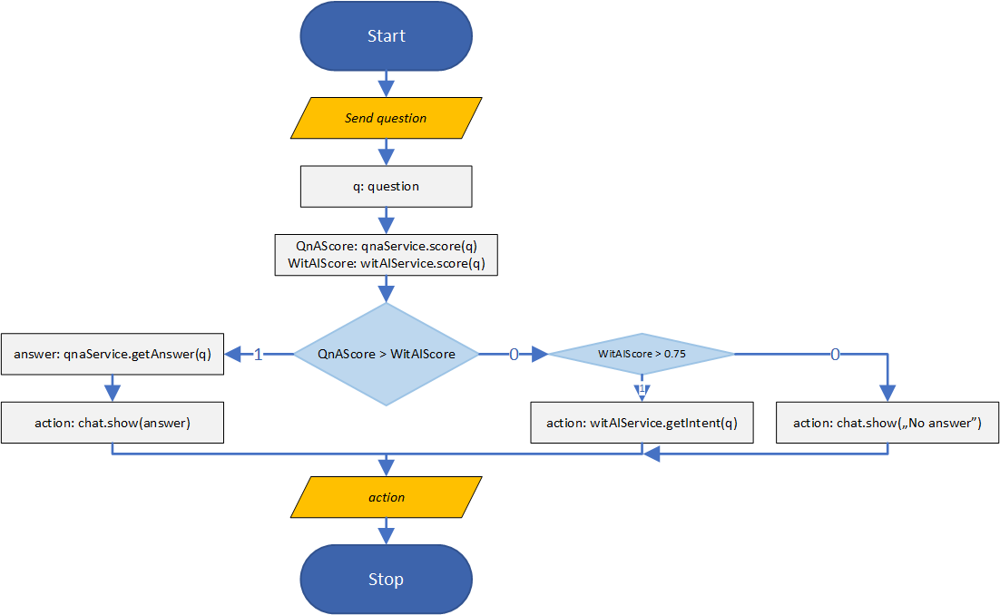
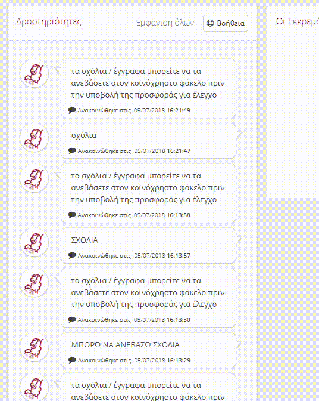
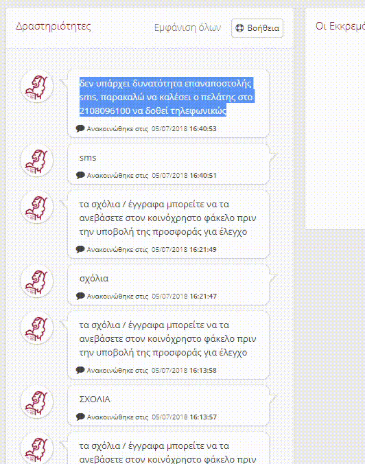

# Information and user action bot scenario in Java

## Overview

### Description

[Java](https://java.com/pl/download/) implementation example of information and user action bot scenario ([QnA Maker](https://www.qnamaker.ai/) + [Wit.ai](https://wit.ai/))

Engagement included:

- [x] Implementing [QnA Maker](https://www.qnamaker.ai/) service by creating a Q&A bot answering questions of brokers towards the underwriters of [Generali Greece](https://www.generali.gr/en/).
- [x] Answers of these questions can be found in a word document with the specific area of topics around health insurance risk assessment, exemptions etc. (Questions->Answer file).
- [x] Natural language understanding ([NLU](https://en.wikipedia.org/wiki/Natural_language_understanding)) was required in Greek so we used another service than [LUIS](https://www.luis.ai/home), [Wit.ai](https://wit.ai/).
- [x] Channel for the bot to be deployed was the custom UI of an internal [Java](https://java.com/pl/download/) web application that is used for communication between brokers and underwriters.
- [x] Chat bot should reply back to a written query which may be a bit wordy. If bot doesn’t understood the topic on which to answer, it should assign the question to an underwriter.

### Solution Base Overview



`1`

`2`

`3`

`4`

`4`

`4`

`4`

`5`

`5`



`1`

`2`

`3`

`3`

`4`



## Table of Contents

- [Project](information-and-user-action-bot-scenario)
- [Overview](#overview)
  - [Description](#description)
  - [Solution Base Overview](#solution-base-overview)
- [Prerequisites](#prerequisites)
  - [Azure Subscription](#azure-subscription)
  - [QnA Maker resource](#qna-maker-resource)
  - [GitHub Account](#github-account)
  - [Wit.ai Account](#wit.ai-account)
  - [Java Environment](#java-environment)
- [Usage](#usage)
- [Testing](#testing)
- [Learnings](#learnings)
- [Credits](#credits)
- [Helpful Materials](#helpful-materials)

## Prerequisites

### Azure Subscription

Various ways to create an Azure Account with a subscription.

- [Azure Free Account](https://azure.microsoft.com/en-us/offers/ms-azr-0044p/)
- [Azure for Students](https://azure.microsoft.com/en-us/free/students/)
- [Azure Pass](https://www.microsoftazurepass.com/Home/HowTo)

### QnA Maker resource

### GitHub Account

### Wit.ai Account

### Java Environment

## Usage


```java
public class QnaMakerKnowledgeBaseRestClient {

	private static final Logger logger = LoggerFactory.getLogger(QnaMakerKnowledgeBaseRestClient.class);

	private static String baseURI = "https://westus.api.cognitive.microsoft.com/qnamaker";

	private static String host = "";

	private static String subscriptionKey = "";

	private static String endpoint_key = "";

  private static String primarysKnowledgeBaseKey = "";
  
  ...

}
```

```java
public JSONObject create(JSONObject createJSONObject) throws Exception {

		JSONObject restOutput = null;

		try {
			HttpClient httpclient = HttpClients.createDefault();
			URIBuilder builder = new URIBuilder(baseURI + "/v4.0/knowledgebases/create");

			URI uri = builder.build();
			HttpPost request = new HttpPost(uri);
			request.setHeader("Content-Type", "application/json");
			request.setHeader("Ocp-Apim-Subscription-Key", subscriptionKey);

			StringEntity reqEntity = new StringEntity(createJSONObject.toString());
			request.setEntity(reqEntity);

			HttpResponse response = httpclient.execute(request);
			HttpEntity entity = response.getEntity();

			if (entity != null) {
				String entityString = EntityUtils.toString(entity);
				restOutput = new JSONObject(entityString);
			}

		} catch(Exception e) {
			logger.error("Error while running QnaMakerKnowledgeBaseRestClient.create() with input: " + createJSONObject.toString(), e);
		}

		return restOutput;
}
```

```java
public JSONObject getEndpointkeys() throws Exception {

		JSONObject restOutput = null;

		try {
			HttpClient httpclient = HttpClients.createDefault();
			URIBuilder builder = new URIBuilder(baseURI + "/v4.0/endpointkeys");

			URI uri = builder.build();
			HttpGet request = new HttpGet(uri);
			request.setHeader("Ocp-Apim-Subscription-Key", subscriptionKey);

			HttpResponse response = httpclient.execute(request);
			HttpEntity entity = response.getEntity();

			if (entity != null) {
				String entityString = EntityUtils.toString(entity);
				restOutput = new JSONObject(entityString);
			}
		} catch(Exception e) {
			logger.error("Error while running QnaMakerKnowledgeBaseRestClient.getEndpointkeys() ", e);
		}

		return restOutput;
}
```

```java
public JSONObject getAnswers(String kb, String question) throws Exception {

		JSONObject restOutput = null;

		try {
			URL url = new URL(host + "/knowledgebases/" + kb + "/generateAnswer");
			String answers = getAnswersPost(url, question);
			if (answers != null) {
				restOutput = new JSONObject(answers);
			}
		} catch(Exception e) {
			logger.error("Error while running QnaMakerKnowledgeBaseRestClient.getAnswers() with kb: " + kb + " and question:" + question, e);
		}

		return restOutput;
}
```

```java
private static String getAnswersPost(URL url, String content) throws Exception {
		String restOutput = null;

		try {
			HttpsURLConnection connection = (HttpsURLConnection) url.openConnection();
			connection.setRequestMethod("POST");
			connection.setRequestProperty("Content-Type", "application/json");
			connection.setRequestProperty("Content-Length", content.length() + "");
			connection.setRequestProperty("Authorization", "EndpointKey " + endpoint_key);
			connection.setDoOutput(true);

			DataOutputStream wr = new DataOutputStream(connection.getOutputStream());
			byte[] encoded_content = content.getBytes("UTF-8");
			wr.write(encoded_content, 0, encoded_content.length);
			wr.flush();
			wr.close();

			StringBuilder response = new StringBuilder();
			InputStreamReader inputStreamReader = new InputStreamReader(connection.getInputStream(), "UTF-8");
			BufferedReader in =new BufferedReader(inputStreamReader);

			String line;
			while ((line = in.readLine()) != null) {
				response.append(line);
			} in .close();

			restOutput = response.toString();

		} catch(Exception e) {
			logger.error("Error while running QnaMakerKnowledgeBaseRestClient.getPrimarysKnowledgeBaseAnswers() with url: " + url + " and content:" + content, e);
		}

		return restOutput;
}
```

```java
public JSONObject getPrimarysKnowledgeBaseAnswers(JSONObject question) throws Exception {

		JSONObject restOutput = null;

		try {
			URL url = new URL(host + "/knowledgebases/" + primarysKnowledgeBaseKey + "/generateAnswer");
			String answers = getAnswersPost(url, question.toString());
			if (answers != null) {
				restOutput = new JSONObject(answers);
			}
		} catch(Exception e) {
			logger.error("Error while running QnaMakerKnowledgeBaseRestClient.getPrimarysKnowledgeBaseAnswers() with kb: " + primarysKnowledgeBaseKey + " and question:" + question, e);
		}

		return restOutput;
}
```

## Testing

```java
private Dialog autoReplyToBroker(GeneraliPrincipal principal, Contact sourceContact, Contact targetContact, String relatedEntityType, String relatedEntityCode, String dialogType, String message) {
	try {
		Dialog dialog = null;
		if (DialogTags.TASK_ASSISTANCE_ANNOUNCEMENT.getCode().equals(dialogType)) {
			QnaMakerKnowledgeBaseRestClient client = new QnaMakerKnowledgeBaseRestClient();
			String jsonString = "{\"question\":\"" + message + "\"}";
			JSONObject restInput = new JSONObject(jsonString);
			JSONObject restOutput = client.getPrimarysKnowledgeBaseAnswers(restInput);
			JSONArray jsArray = ((JSONArray) restOutput.getJSONArray("answers"));
			Double finalScore = 0.00;
			String finalAnswer = "";
			if (jsArray != null) {
				if (jsArray.length() > 0) {
					for (int i = 0; i < jsArray.length(); i++) {
						JSONObject jsObject = (JSONObject) jsArray.get(i);
						String answer = (String) jsObject.get("answer");
						Double score = (Double) jsObject.get("score");
						if (score > finalScore) {
							if (answer != null) {
								answer = Converters.asTrimmedString(answer);
								finalScore = score;
								finalAnswer = answer;
							}
						}
					}
				}
			}
			if (finalAnswer.length() > 0) {
				dialog = notifyBrokerForComment(principal, sourceContact, targetContact, relatedEntityType, relatedEntityCode, dialogType, finalAnswer);
			}
		}

		return dialog;
	} catch(Exception e) {
		throw new DataAccessException("Error while running taskService.autoReplyToBroker", e);
	}
}
```





## Learnings

## Credits

## Helpful Materials

### QnA Maker:

- using Java with QnA Maker API (Creating, Updating, Geting a statuses, Publishing, etc. of Knowledge Base):  https://docs.microsoft.com/en-us/azure/cognitive-services/qnamaker/quickstarts/java
- QnA Maker V4.0 APIs Documentation (Java code snippets are included at the bottom of the website): https://westus.dev.cognitive.microsoft.com/docs/services/5a93fcf85b4ccd136866eb37/operations/5ac266295b4ccd1554da75ff
- QnA Maker Portal: https://qnamaker.ai 
- What is QnA Maker?: https://docs.microsoft.com/en-us/azure/cognitive-services/qnamaker/overview/overview
- QnA Maker supported languages: https://docs.microsoft.com/en-us/azure/cognitive-services/qnamaker/overview/languages-supported
- How Knowledge Base lifecycle should look like: https://docs.microsoft.com/en-us/azure/cognitive-services/qnamaker/concepts/development-lifecycle-knowledge-base
- QnA Maker Dialog (Active Learning), link from old docs: https://www.qnamaker.ai/old/Documentation/ActiveLearning

### Bot Builder SDK (Java):

- Repository: https://github.com/Microsoft/botbuilder-java/wiki
- Documentation: https://docs.microsoft.com/en-us/azure/bot-service/?view=azure-bot-service-4.0
- Sample: https://github.com/Microsoft/botbuilder-java/wiki/building-the-sdk

### Pricing:

- QnA Maker API Service: https://azure.microsoft.com/en-us/pricing/details/cognitive-services/qna-maker/
  - Free - up to 3 managed documents (KBs) 1MB each | FREE
  - Standard - no limit | ~8.433EURO/month
- Azure App Service (for the QnA Maker runtime): https://azure.microsoft.com/en-in/pricing/details/app-service/windows/
- Azure Search (for the QnA Maker data): https://azure.microsoft.com/en-us/pricing/details/search/


|                        | QnA Maker Management | App Service | Azure Search | Limitations                      |
|------------------------|:--------------------:|:-----------:|:------------:|:--------------------------------:|
| Experimentation        | Free SKU             | Free Tier   | Free Tier    | Publish Up to 2 KBs, 50 MB size  |
| Dev/Test Environment   | Standard SKU         | Shared      | Basic        | Publish Up to 4 KBs, 2 GB size   |
| Production Environment | Standard SKU         | Basic       | Standard     | Publish Up to 49 KBs, 25 GB size	|