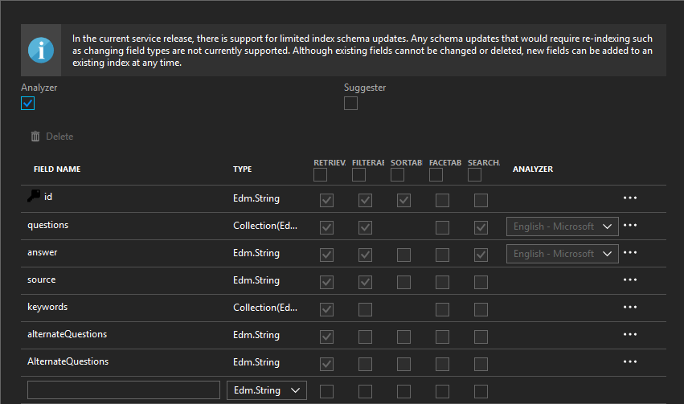

# Information and user action bot scenario in Java

## Overview

### Description

This repository contains a proof of concept materials and [Java](https://java.com/pl/download/) code examples that were used in the creation and implementation of information and user action bot scenario ([QnA Maker](https://www.qnamaker.ai/) + [Wit.ai](https://wit.ai/)) in [Generali Greece](https://www.generali.gr/en/).

The business challenge was to automate the work of a [Generali Greece](https://www.generali.gr/en/) employee (underwriter) and save the time & resources during information exchange with the broker.

Engagement included:

- [x] Implementing [QnA Maker](https://www.qnamaker.ai/) service by creating a **Q&A bot** answering questions of brokers towards the underwriters of [Generali Greece](https://www.generali.gr/en/).
- [x] Answers of these questions were in a **CSV** file with the specific area of topics around health insurance risk assessment, exemptions etc. (Questions->Answer file).
- [x] Natural language understanding ([NLU](https://en.wikipedia.org/wiki/Natural_language_understanding)) was required in Greek so we used another service than [LUIS](https://www.luis.ai/home), [Wit.ai](https://wit.ai/).
- [x] Channel for the bot to be deployed was the custom UI of an internal [Java](https://java.com/pl/download/) web application that is used for **communication between brokers and underwriters**.
- [x] Reply back to a written query which may be a bit wordy. If topic was not understandable, question was assigned to the underwriter.

### Solution Base Overview

The target solution and its architecture has various services implemented, resulting in a fully automated information exchange channel. At the moment, the solution includes implemented [QnA Maker](https://www.qnamaker.ai/) service and the primary method of automating tasks in the internal tool (previously supported by the underwriter and now by [Wit.ai](https://wit.ai/)).

Below are descriptions of solution architecture (in an advanced and basic scenario):


`1`  The broker starts an application, and his credentials are validated.

`2`  Broker starts a dialog with a bot by typing a question or a command/task.

`3`  The question is processed by a Bot Service algorithms and passed through the specific methods of implemented services. There are a few examples of service incorporation.

`4`  These algorithms can invoke a method from NLU service (like [Wit.ai](https://wit.ai/) or [LUIS](https://www.luis.ai/home)) to automate a task within application's backend (in this example it was a generated storage for a document upload).

`4`  Alternatively, invoke a method from [Cognitive Services](https://azure.microsoft.com/en-us/services/cognitive-services/), like [QnA Maker](https://www.qnamaker.ai/) - to receive an answer regarding expert knowledge around health insurance risk assessments, exemptions, and so forth.

`4`  Or, invoke a method that search for an entity from the database, like the current status of some deal, or the date of the contract, etc.

`4`  In case of a specific kind of query, which is not understandable, the question is assigned to the underwriter...

`5`  ... who responds in person.

`5`  Otherwise, the bot is sending the actions/answers, done by particular services, back to the broker.

<hr>


`1`  The broker starts a dialog with a bot by typing a query/question into the application chat window.

`2`  A controller is processing input and passing it through different methods and services.

`3`  [QnA Maker](https://www.qnamaker.ai/), which is a service with a Knowledge Base and answers around health insurance - the specific stuff.

`3`  [Wit.ai](https://wit.ai/), which supports an [NLU](https://en.wikipedia.org/wiki/Natural_language_understanding) in the Greek language, and can automate specific kind of tasks in place of the underwriter.

`4`  After scoring, the controller updates an application chat window view by providing the right answer or setting up specific resource for the broker.

<hr>

The flowchart below shows the idea of the scoring process:


**In that case, the score is a value of confidence in each service.**

## Table of Contents

- [Project](information-and-user-action-bot-scenario)
- [Overview](#overview)
  - [Description](#description)
  - [Solution Base Overview](#solution-base-overview)
- [Prerequisites](#prerequisites)
  - [Azure Subscription](#azure-subscription)
  - [QnA Maker resource](#qna-maker-resource)
  - [Wit.ai Account](#witai-account)
  - [Java Environment](#java-environment)
- [Usage](#usage)
  - [QnA Maker](#qna-maker)
  - [Wit.ai](#witai)
- [Testing](#testing)
- [Learnings](#learnings)
  - [QnA Maker](#qna-maker-learnings)
  - [Wit.ai](#wit-ai-learnings)
  - [The nature of the Greek language](#the-nature-of-the-greek-language)
- [Credits](#credits)
- [Helpful Materials](#helpful-materials)

## Prerequisites

### Azure Subscription

Various ways to create an Azure Account with a subscription.

- [Azure Free Account](https://azure.microsoft.com/en-us/offers/ms-azr-0044p/)
- [Azure for Students](https://azure.microsoft.com/en-us/free/students/)
- [Azure Pass](https://www.microsoftazurepass.com/Home/HowTo)

### QnA Maker resource

QnA Maker - https://qnamaker.ai

1. To create a service, go to Azure Portal and search for *"QnA Maker"*:

   - 

2. After you choose it, read the description and click Create:

   - 

3. Configure your service by naming it, selecting right pricing tier (details about pricing - [here](#pricing)), etc.:

   - 

### Wit.ai Account

wit.ai - https://wit.ai

1. Log in with [GitHub](https://github.com/) or [Facebook](https://www.facebook.com/) account:

   - 

### Java Environment

- Java SE 6 / 7
- Java UI Framework
- Documentum

## Usage

### QnA Maker

1. Follow the instructions in the [QnA Maker](https://www.qnamaker.ai/) Portal in "Create a knowledge base" view:

   - 

   - 

2. Publish Knowledge Base and get requeired Keys and Endpoint addresses (after Publish, go to Settings tab):

   - 

3. Code snippets below represent an implemented basic methods for [QnA Maker](https://www.qnamaker.ai/) service:

<hr>

*QnAMaker Service Client (Remember to provide a valid Keys and Endpoints) :*
```java
public class QnaMakerKnowledgeBaseRestClient {

  private static final Logger logger = LoggerFactory.getLogger(QnaMakerKnowledgeBaseRestClient.class);

  private static String baseURI = "https://westus.api.cognitive.microsoft.com/qnamaker";

  private static String host = "https://<qnamakerservice-name>.azurewebsites.net/qnamaker";

  private static String subscriptionKey = "<from-azure-portal--go-to-qna-maker-service-resource-management-keys>";

  private static String endpoint_key = "<endpoint-key>";

  private static String primarysKnowledgeBaseKey = "<kbid>";
  
  ...

}
```
<hr>

*Knowledge Base Create method:*
```java
public JSONObject create(JSONObject createJSONObject) throws Exception {

    JSONObject restOutput = null;

    try {
      HttpClient httpclient = HttpClients.createDefault();
      URIBuilder builder = new URIBuilder(baseURI + "/v4.0/knowledgebases/create");

      URI uri = builder.build();
      HttpPost request = new HttpPost(uri);
      request.setHeader("Content-Type", "application/json");
      request.setHeader("Ocp-Apim-Subscription-Key", subscriptionKey);

      StringEntity reqEntity = new StringEntity(createJSONObject.toString());
      request.setEntity(reqEntity);

      HttpResponse response = httpclient.execute(request);
      HttpEntity entity = response.getEntity();

      if (entity != null) {
        String entityString = EntityUtils.toString(entity);
        restOutput = new JSONObject(entityString);
      }

    } catch(Exception e) {
      logger.error("Error while running QnaMakerKnowledgeBaseRestClient.create() with input: " + createJSONObject.toString(), e);
    }

    return restOutput;
}
```
<hr>

*Get Endpoint keys from a published Knowledge Base:*
```java
public JSONObject getEndpointkeys() throws Exception {

    JSONObject restOutput = null;

    try {
      HttpClient httpclient = HttpClients.createDefault();
      URIBuilder builder = new URIBuilder(baseURI + "/v4.0/endpointkeys");

      URI uri = builder.build();
      HttpGet request = new HttpGet(uri);
      request.setHeader("Ocp-Apim-Subscription-Key", subscriptionKey);

      HttpResponse response = httpclient.execute(request);
      HttpEntity entity = response.getEntity();

      if (entity != null) {
        String entityString = EntityUtils.toString(entity);
        restOutput = new JSONObject(entityString);
      }
    } catch(Exception e) {
      logger.error("Error while running QnaMakerKnowledgeBaseRestClient.getEndpointkeys() ", e);
    }

    return restOutput;
}
```
<hr>

*Get an answer from question method:*
```java
public JSONObject getAnswers(String kb, String question) throws Exception {

    JSONObject restOutput = null;

    try {
      URL url = new URL(host + "/knowledgebases/" + kb + "/generateAnswer");
      String answers = getAnswersPost(url, question);
      if (answers != null) {
        restOutput = new JSONObject(answers);
      }
    } catch(Exception e) {
      logger.error("Error while running QnaMakerKnowledgeBaseRestClient.getAnswers() with kb: " + kb + " and question:" + question, e);
    }

    return restOutput;
}
```
<hr>

*HTTP Service helper method for Get an answer from question method:*
```java
private static String getAnswersPost(URL url, String content) throws Exception {
    String restOutput = null;

    try {
      HttpsURLConnection connection = (HttpsURLConnection) url.openConnection();
      connection.setRequestMethod("POST");
      connection.setRequestProperty("Content-Type", "application/json");
      connection.setRequestProperty("Content-Length", content.length() + "");
      connection.setRequestProperty("Authorization", "EndpointKey " + endpoint_key);
      connection.setDoOutput(true);

      DataOutputStream wr = new DataOutputStream(connection.getOutputStream());
      byte[] encoded_content = content.getBytes("UTF-8");
      wr.write(encoded_content, 0, encoded_content.length);
      wr.flush();
      wr.close();

      StringBuilder response = new StringBuilder();
      InputStreamReader inputStreamReader = new InputStreamReader(connection.getInputStream(), "UTF-8");
      BufferedReader in =new BufferedReader(inputStreamReader);

      String line;
      while ((line = in.readLine()) != null) {
        response.append(line);
      } in .close();

      restOutput = response.toString();

    } catch(Exception e) {
      logger.error("Error while running QnaMakerKnowledgeBaseRestClient.getPrimarysKnowledgeBaseAnswers() with url: " + url + " and content:" + content, e);
    }

    return restOutput;
}
```
<hr>

*Get an answer from question primary method:*
```java
public JSONObject getPrimarysKnowledgeBaseAnswers(JSONObject question) throws Exception {

    JSONObject restOutput = null;

    try {
      URL url = new URL(host + "/knowledgebases/" + primarysKnowledgeBaseKey + "/generateAnswer");
      String answers = getAnswersPost(url, question.toString());
      if (answers != null) {
        restOutput = new JSONObject(answers);
      }
    } catch(Exception e) {
      logger.error("Error while running QnaMakerKnowledgeBaseRestClient.getPrimarysKnowledgeBaseAnswers() with kb: " + primarysKnowledgeBaseKey + " and question:" + question, e);
    }

    return restOutput;
}
```

### Wit.ai

1. To create an app in [Wit.ai](https://wit.ai/), click on the PLUS symbol:

   - 

2. Add name and description and choose desired language (important!):

   - 

3. Start by adding more and more examples of sentences, and edit/add entities (intents, [Wit.ai](https://wit.ai/) specifics or your entities):

   - 

## Testing

Here is a code fragment of an auto-reply method, which invokes a code from implemented QnA Service Client.

```java
private Dialog autoReplyToBroker(GeneraliPrincipal principal, Contact sourceContact, Contact targetContact, String relatedEntityType, String relatedEntityCode, String dialogType, String message) {
  try {
    Dialog dialog = null;
    if (DialogTags.TASK_ASSISTANCE_ANNOUNCEMENT.getCode().equals(dialogType)) {
      QnaMakerKnowledgeBaseRestClient client = new QnaMakerKnowledgeBaseRestClient();
      String jsonString = "{\"question\":\"" + message + "\"}";
      JSONObject restInput = new JSONObject(jsonString);
      JSONObject restOutput = client.getPrimarysKnowledgeBaseAnswers(restInput);
      JSONArray jsArray = ((JSONArray) restOutput.getJSONArray("answers"));
      Double finalScore = 0.00;
      String finalAnswer = "";
      if (jsArray != null) {
        if (jsArray.length() > 0) {
          for (int i = 0; i < jsArray.length(); i++) {
            JSONObject jsObject = (JSONObject) jsArray.get(i);
            String answer = (String) jsObject.get("answer");
            Double score = (Double) jsObject.get("score");
            if (score > finalScore) {
              if (answer != null) {
                answer = Converters.asTrimmedString(answer);
                finalScore = score;
                finalAnswer = answer;
              }
            }
          }
        }
      }
      if (finalAnswer.length() > 0) {
        dialog = notifyBrokerForComment(principal, sourceContact, targetContact, relatedEntityType, relatedEntityCode, dialogType, finalAnswer);
      }
    }

    return dialog;
  } catch(Exception e) {
    throw new DataAccessException("Error while running taskService.autoReplyToBroker", e);
  }
}
```

The goal was to receive an answer with details about contact to [Generali Greece](https://www.generali.gr/en/).
You can see the results of the actions on the following animations:

1. Simple query, by providing a keyword *"sms"*.

   - 

2. Complex query, by providing a sentence in greek language.

   - 

Another achievement was to test a [Wit.ai](https://wit.ai/) app by providing sentences in the Greek language:

1. Here [Wit.ai](https://wit.ai/) recognizes an intent by locating the name of sickness and type of action.

   - 

2. The second example shows that [Wit.ai](https://wit.ai/) can recognize a phone number entity and a type of action.

   - 

3. Created entities for that test.

   - 

## Learnings

### QnA Maker learnings

The QnA Maker documentation shows that the service can support many languages, but in practice, it is entirely different.
Here you can read more about the supported languages: https://docs.microsoft.com/en-us/azure/cognitive-services/qnamaker/overview/languages-supported

Supposedly, **the language is automatically recognized from the content** of the data sources being extracted. Once you create a new QnA Maker Service and a new Knowledge Base in that service, you can verify that the language has been set correctly. More details about the whole process you can find here: https://docs.microsoft.com/en-us/azure/cognitive-services/qnamaker/how-to/language-knowledge-base

:bug: :bug: :bug: **In practice it is always English** :bug: :bug: :bug:

I was trying to fix that in many different ways...

- by uploading Question/Answer file before KB creation
- by uploading Question/Answer file after KB creation
- by providing Questions and Answers manually
- by creating different resources with a different pricing tier
- by creating a standalone Azure Search resource and trying to modify it and connect it with the existing resource of QnA Maker

...unfortunately without any success.

Here you can investigate my steps:

1. Langauge support analyzer investigation in testkb index resource.

   - 

2. Langauge support analyzer investigation in specific index resource.

   - 

3. Creating new Azure Search resource.

   - 

4. Updating keys and names in App Service.

   - 

### Wit.ai learnings

Unfortunately, the Greek language in the Wit.ai service is still in beta, so the recognition of such things as contact is difficult to implement.

1. Here you can see my manual selection of a name "John", but still without any improvement after clicking "Validate".

   - 

### The nature of the Greek language

With these difficulties (above), we are also unable to determine how the algorithm behaves when we include Greek-language specific letters or words.
The endings of words or accents that occur with individual letters are still binary values that can be understood by the machine differently.

For example brokers by typing a query can be in a hurry, and they will type

- **εχω**

instead of

- **έχω**

which means 'I have'.

In that particular case, the meaning is the same, with or without a tone/accent. However imagine words with a different meaning, after erasing such tone or accent.


## Credits

- Antonis Apergis - Software Development Supervisor, [Generali Greece](https://www.generali.gr/en/)
- Christodoulos Rokos - Senior Software Engineer, [Generali Greece](https://www.generali.gr/en/)
- Borys Rybak (*who fell in love with Greece*) - Software Engineer, Microsoft


## Helpful Materials

### QnA Maker:

- using Java with QnA Maker API (Creating, Updating, Geting a statuses, Publishing, etc. of Knowledge Base):  https://docs.microsoft.com/en-us/azure/cognitive-services/qnamaker/quickstarts/java
- QnA Maker V4.0 APIs Documentation (Java code snippets are included at the bottom of the website): https://westus.dev.cognitive.microsoft.com/docs/services/5a93fcf85b4ccd136866eb37/operations/5ac266295b4ccd1554da75ff
- QnA Maker Portal: https://qnamaker.ai 
- What is QnA Maker?: https://docs.microsoft.com/en-us/azure/cognitive-services/qnamaker/overview/overview
- QnA Maker supported languages: https://docs.microsoft.com/en-us/azure/cognitive-services/qnamaker/overview/languages-supported
- How Knowledge Base lifecycle should look like: https://docs.microsoft.com/en-us/azure/cognitive-services/qnamaker/concepts/development-lifecycle-knowledge-base
- Adding Filters (metadata) to Questions/Answer pairs: https://westus.dev.cognitive.microsoft.com/docs/services/597029932bcd590e74b648fb/operations/597037798a8bb5031800bf5b
- QnA Maker Dialog (Active Learning), link from old docs: https://www.qnamaker.ai/old/Documentation/ActiveLearning

### Bot Builder SDK (Java):

- Repository: https://github.com/Microsoft/botbuilder-java/wiki
- Documentation: https://docs.microsoft.com/en-us/azure/bot-service/?view=azure-bot-service-4.0
- Sample: https://github.com/Microsoft/botbuilder-java/wiki/building-the-sdk

### Pricing:

- QnA Maker API Service: https://azure.microsoft.com/en-us/pricing/details/cognitive-services/qna-maker/
  - Free - up to 3 managed documents (KBs) 1MB each | FREE
  - Standard - no limit | ~8.433EURO/month
- Azure App Service (for the QnA Maker runtime): https://azure.microsoft.com/en-in/pricing/details/app-service/windows/
- Azure Search (for the QnA Maker data): https://azure.microsoft.com/en-us/pricing/details/search/


|                        | QnA Maker Management | App Service | Azure Search | Limitations                      |
|------------------------|:--------------------:|:-----------:|:------------:|:--------------------------------:|
| Experimentation        | Free SKU             | Free Tier   | Free Tier    | Publish Up to 2 KBs, 50 MB size  |
| Dev/Test Environment   | Standard SKU         | Shared      | Basic        | Publish Up to 4 KBs, 2 GB size   |
| Production Environment | Standard SKU         | Basic       | Standard     | Publish Up to 49 KBs, 25 GB size	|